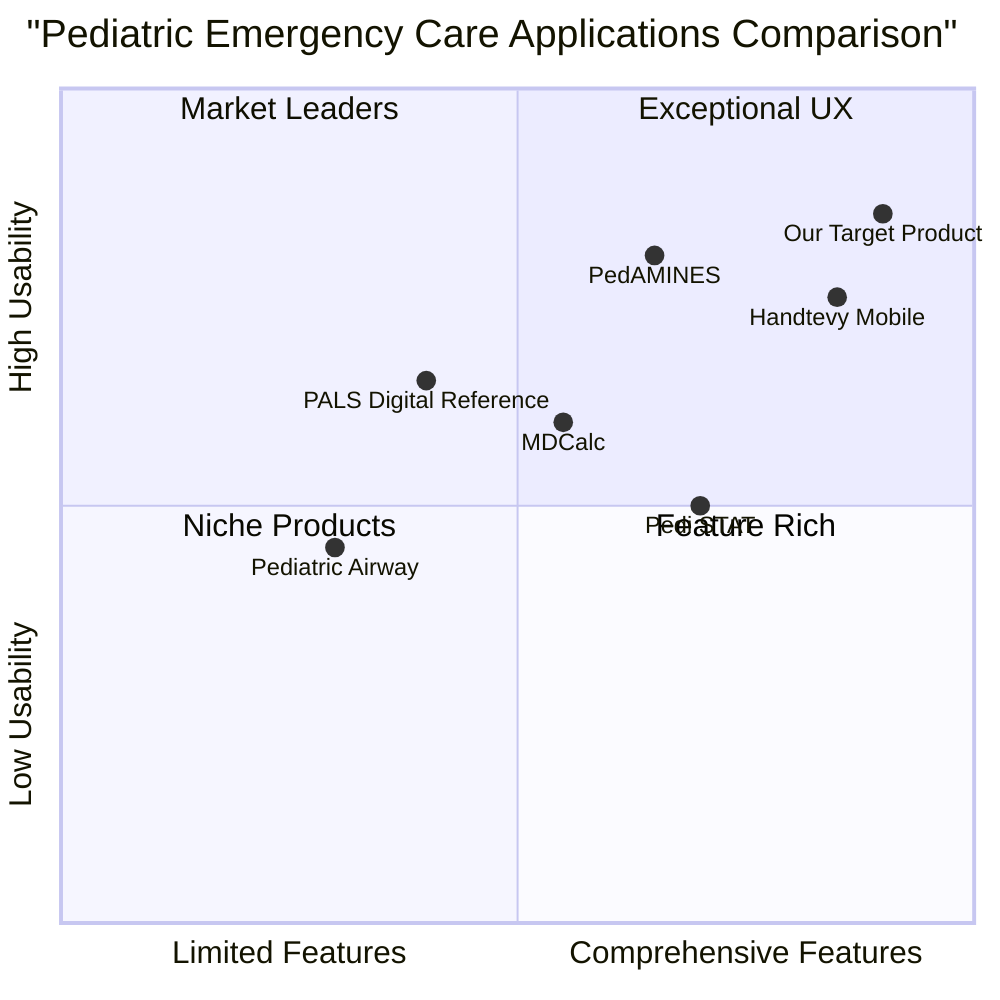

# Product Requirements Document: Paramedic Pediatric Emergency Care Web Application

## Project Information

**Project Name:** pediatric_emergency_care_web_app
**Original Requirements:** Create a comprehensive web application for paramedic pediatric emergency care following detailed requirements. The application must include PALS Algorithms, Rapid Dosing calculations, Equipment Sizing, Physiological Parameters by age group, Checklists, CPR Assist features, Offline Capability, and Emergency Contact management with mobile-first responsive design.

## 1. Product Definition

### 1.1 Product Goals

1. **Reduce Medication Errors:** Provide accurate, rapid medication dosing calculations to minimize errors in high-stress pediatric emergency situations.

2. **Expedite Critical Interventions:** Deliver instant access to pediatric emergency protocols and algorithms, reducing time to critical interventions.

3. **Improve Patient Outcomes:** Support healthcare providers with comprehensive tools that enhance the quality of pediatric emergency care in high-stress, prehospital environments.

### 1.2 User Stories

1. **As a paramedic** responding to a pediatric cardiac arrest, I want immediate access to weight-based medication dosing and PALS algorithms so that I can deliver appropriate care without calculation errors.

2. **As an emergency nurse** treating a pediatric patient with severe respiratory distress, I want quick access to age-appropriate equipment sizing so that I can select the correct endotracheal tube size without delay.

3. **As an EMS physician** overseeing pediatric emergency care, I want to customize protocols and medication calculations to match our agency's standards so that all providers follow consistent practices.

4. **As a paramedic** working in a rural area with limited connectivity, I want offline access to pediatric emergency tools so that I can provide optimal care regardless of internet access.

5. **As an emergency medical technician** with limited pediatric experience, I want access to normal vital sign ranges by age so that I can quickly assess the severity of a child's condition.

### 1.3 Competitive Analysis

| Product | Pros | Cons |
|---------|------|------|
| **PedAMINES** | - Proven to reduce medication errors - Intuitive drug preparation interface - Validated in clinical studies | - Limited to medication dosing - Not fully customizable to agency protocols - Requires continuous updates |
| **Handtevy Mobile** | - Comprehensive pediatric dosing system - Customizable to local protocols - Integration with EHR systems | - Subscription-based model - Complex implementation process - Limited offline capabilities |
| **PALS Digital Reference** | - Official AHA guidelines - Regularly updated protocols - Standardized algorithms | - Limited customization - No medication calculation - No CPR assistance features |
| **MDCalc** | - Wide range of medical calculators - Evidence-based tools - Regular updates | - Not specific to pediatric emergencies - No offline mode - Not optimized for emergency workflows |
| **Pedi STAT** | - Comprehensive emergency calculations - Multiple reference charts - Easy navigation | - Limited protocol guidance - No CPR timing features - Limited customization options |
| **Pediatric Airway** | - Detailed airway management guidance - Equipment sizing calculators - Visual instructions | - Limited scope (airway only) - No medication dosing - Limited protocol integration |
| **Our Target Product** | - Comprehensive all-in-one solution - Works offline - Customizable to agency protocols - CPR assistance with timers | - New to market - Requires regular content updates - Initial learning curve |

### 1.4 Competitive Quadrant Chart

## 2. Technical Specifications

### 2.1 Requirements Analysis

The Paramedic Pediatric Emergency Care Web Application must be a comprehensive, mobile-first web application designed for healthcare providers managing pediatric emergencies. The application must function effectively in high-stress environments, provide accurate clinical information, and operate with or without internet connectivity.

The core technical needs include:

1. **Cross-Platform Web Development:** A responsive design that works seamlessly across all devices (desktop, tablet, mobile) and major browsers.

2. **Offline Functionality:** Implementation of Progressive Web App (PWA) capabilities to ensure core features work without internet connectivity.

3. **Real-Time Calculations:** Fast, accurate medication dosing and equipment sizing based on patient parameters.

4. **User Authentication:** Secure login system with role-based access for different provider types.

5. **Data Persistence:** Local storage of user preferences, customized protocols, and emergency contacts.

6. **Performance Optimization:** Fast loading times and smooth interactions, even on lower-end devices.

7. **Regular Data Updates:** Mechanism to update clinical protocols when connected to the internet.

8. **Integration Capabilities:** API endpoints for potential integration with Electronic Patient Care Record (ePCR) systems.

### 2.2 Requirements Pool

#### P0: Must-Have Requirements

1. **PALS Algorithms Module**
   - Must include all current PALS algorithms (cardiac arrest, bradycardia, tachycardia, post-resuscitation)
   - Must present algorithms in a step-by-step, easy-to-follow format
   - Must include visual guides for rhythm identification

2. **Medication Dosing Calculator**
   - Must calculate weight-based medication doses for all emergency pediatric medications
   - Must display medication doses in volume format based on standard concentrations
   - Must allow customization of medication concentrations to match local formulary

3. **Equipment Sizing Calculator**
   - Must provide recommendations for endotracheal tube sizes based on age, weight, or length
   - Must include sizing for other critical equipment (mask sizes, laryngoscope blades, etc.)

4. **Vital Signs Reference**
   - Must display normal vital sign ranges organized by age group
   - Must clearly indicate abnormal values

5. **Offline Functionality**
   - Must function fully without internet connection for all critical care features
   - Must store required data locally on the device

#### P1: Should-Have Requirements

1. **CPR Assist Module**
   - Should provide audio and visual cues for CPR timing
   - Should include timers for medication administration intervals
   - Should allow customization of CPR protocols (compression rates, etc.)

2. **Customizable Checklists**
   - Should include pre-defined checklists for common scenarios
   - Should allow users to create and save custom checklists
   - Should track checklist completion during care events

3. **User Authentication**
   - Should support secure user accounts
   - Should allow for organization-specific logins
   - Should maintain user preferences across sessions

4. **Agency Protocol Management**
   - Should allow uploading and management of agency-specific protocols
   - Should support protocol versioning

5. **Data Synchronization**
   - Should synchronize data when internet connectivity is restored
   - Should handle conflicts in data updates appropriately

#### P2: Nice-to-Have Requirements

1. **Emergency Contacts Management**
   - May include the ability to store and quickly access important contacts
   - May provide direct-call functionality from within the application
   - May include hospital information and navigation directions

2. **Integration with ePCR Systems**
   - May provide API for data exchange with electronic patient care record systems
   - May allow export of treatment data in standardized formats

3. **Educational Content**
   - May include reference material for continued learning
   - May provide case-based scenarios for practice

4. **Multi-language Support**
   - May offer interface in multiple languages
   - May include language switching without data loss

5. **Usage Analytics**
   - May collect anonymous usage statistics to improve the application
   - May provide administrators with insights on feature utilization

### 2.3 UI Design Draft

#### Global Navigation

The application will feature a bottom navigation bar for mobile devices (converting to side navigation on larger screens) with the following primary sections:

1. **PALS** - Access to all PALS algorithms
2. **Dosing** - Medication dosing calculator
3. **Equipment** - Equipment sizing recommendations
4. **Vitals** - Vital signs reference by age
5. **Tools** - Additional tools including CPR assist, checklists, and contacts

#### Key Screens

1. **Home Screen**
   - Quick access buttons to most critical functions
   - Patient parameter input (age, weight, length)
   - Indication of online/offline status

2. **PALS Algorithm Screen**
   - Algorithm selection menu
   - Step-by-step presentation with clear forward/back navigation
   - Visual indicators for decision points
   - Pop-up details for medications and procedures

3. **Medication Dosing Screen**
   - Patient parameter display with edit option
   - Medication category filters
   - Clearly displayed dosing information with concentration options
   - Volume calculation with administration guidance

4. **Equipment Sizing Screen**
   - Visual representations of equipment
   - Size recommendations based on patient parameters
   - Alternative size suggestions

5. **CPR Assist Screen**
   - Large, visible timer
   - Audio metronome with volume control
   - Medication timing reminders
   - Quick access to related algorithms

#### Visual Design Principles

1. **Color Coding**
   - Use of red for critical actions/information
   - Yellow for cautions/warnings
   - Green for normal values/completed actions
   - High contrast for readability in all environments

2. **Typography**
   - Large, clear fonts for critical information
   - Hierarchical type system for information organization
   - Optimized for readability in stressful situations

3. **Interaction Design**
   - Large touch targets for gloved hand operation
   - Minimal text entry requirements
   - Clear feedback for all user actions
   - Swipe gestures for moving through sequential steps

### 2.4 Open Questions

1. **Content Authority and Updates**
   - Who will be responsible for validating the clinical content accuracy?  
   - What is the process for updating content when guidelines change?
   - How frequently should content be reviewed for currency?

2. **User Permissions and Access**
   - Should different user types have different access levels to features?
   - How will custom protocols be validated before implementation?
   - What organizations' approval is needed for protocol customization?

3. **Integration Capabilities**
   - Which specific ePCR systems should be prioritized for integration?
   - What data exchange standards should be supported?
   - How will patient privacy be maintained during any data sharing?

4. **Deployment Strategy**
   - Should the application be available publicly or through organizational accounts only?
   - Will there be a freemium model with basic vs. advanced features?
   - How will users be notified of critical updates?

5. **Liability Considerations**
   - What disclaimers are needed regarding clinical decision support?
   - How will errors in the application be reported and addressed?
   - What audit trail capabilities are needed for usage in patient care?

## 3. Success Metrics

### 3.1 User Adoption Metrics

1. **Active Users**
   - Number of daily, weekly, and monthly active users
   - User retention rate over 3, 6, and 12 months
   - Time spent per session

2. **Feature Utilization**
   - Most accessed algorithms and references
   - Frequency of medication calculator usage
   - Engagement with CPR assist features

### 3.2 Clinical Impact Metrics

1. **Self-reported Medication Error Reduction**
   - Survey data on prevented medication errors
   - Comparison to historical error rates where available

2. **Time Savings**
   - Measured time to calculate doses with vs. without the application
   - Reported time savings during critical interventions

3. **Provider Confidence**
   - Survey data on provider confidence in pediatric resuscitations
   - Comfort level with pediatric medication administration

### 3.3 Technical Performance Metrics

1. **Application Performance**
   - Page load times across device types
   - Calculation processing speed
   - Offline functionality reliability

2. **Error Rates**
   - Number of reported calculation errors
   - Application crashes or failures
   - Sync errors when reconnecting to network

## 4. Implementation Timeline

### Phase 1: Core Development (Weeks 1-6)
- Requirements finalization and technical specification
- Database schema and API design
- UI/UX detailed design
- Core application framework development
- Implementation of offline capabilities

### Phase 2: Feature Implementation (Weeks 7-14)
- PALS algorithms module development
- Medication dosing calculator implementation
- Equipment sizing calculator development
- Vital signs reference module
- User authentication system

### Phase 3: Advanced Features & Testing (Weeks 15-20)
- CPR assist module implementation
- Customizable checklists development
- Agency protocol management system
- Comprehensive testing across devices
- Security and performance optimization

### Phase 4: Deployment & Monitoring (Weeks 21-24)
- Beta testing with selected user groups
- Feedback incorporation and refinement
- Production deployment
- Monitoring and initial support
- Documentation and training materials

## 5. Tech Stack Recommendations

### Frontend
- **Framework**: React.js with TypeScript for robust, type-safe code
- **UI Library**: Material UI with custom theming for responsive design
- **State Management**: Redux for global state, Context API for component state
- **PWA Implementation**: Workbox for service workers and offline caching
- **Storage**: IndexedDB for structured data storage, LocalStorage for preferences

### Backend
- **Framework**: Node.js with Express for API endpoints
- **Database**: MongoDB for flexible schema management
- **Authentication**: JWT-based authentication with role-based access control
- **API**: RESTful API design with versioning
- **Hosting**: Cloud platform with global CDN for fast content delivery

### Development Tools
- **Version Control**: Git with feature branch workflow
- **CI/CD**: Automated testing and deployment pipeline
- **Code Quality**: ESLint, Prettier, and automated testing
- **Monitoring**: Application performance monitoring and error tracking

## 6. Conclusion

The Paramedic Pediatric Emergency Care Web Application addresses a critical need in emergency medical services by providing comprehensive, accurate, and accessible tools for pediatric emergency care. By focusing on reducing medication errors, expediting critical interventions, and improving patient outcomes, this application has the potential to significantly enhance the quality of pediatric emergency care in prehospital and hospital settings.

The implementation of this product should prioritize accuracy, usability in high-stress environments, and reliable offline functionality. Regular updates to clinical content and continuous improvement based on user feedback will be essential for long-term success.